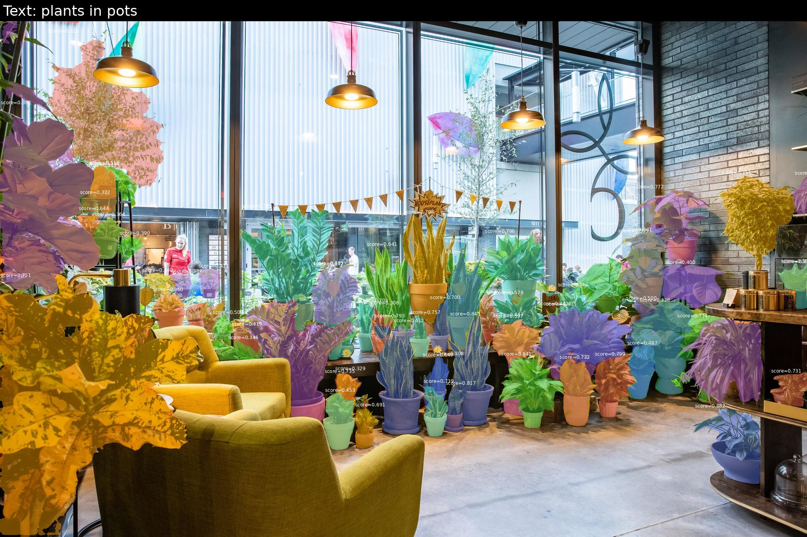

# SAM3-to-ONNX

A package for exporting Meta's [SAM 3.0](https://github.com/facebookresearch/sam3) image segmentation model to ONNX.  

## Installation

1. This package uses the Hugging Face model hub and transformers library.
Before you begin make sure you have an account with [Hugging Face](https://huggingface.co/) and have received permission to access the [facebook/sam3 repo](https://huggingface.co/facebook/sam3).

2. Next create a new python environment using your favorite manager (venv, pyenv, uv, conda, etc.)
and run:

```bash
pip install -e .
```

## Conversion to ONNX
First make sure you are logged in to hugging face using:

```bash
hf auth login
```

To create the ONNX models run:

```bash
python exportsam3/export_sam3.py --all
```

This will export all 3 model components that you need to run inference (image encoder, text encoder, decoder) saving them in outputs/onnx

For additional export options run:

```bash
python exportsam3/export_sam3.py --help
```

### Optimization

You can cut the model sizes of the image encoder and text encoder in half by converting
supported ops and their associated weights to fp16 precision.

Generate mixed precision models using:

```bash
python exportsam3/optimization.py
```

Notes: 

* currently there is no optimization pass being run on the decoder.  It's already fairly small and inference is fast.

* All of the optimizations run on CPU and can take a while, so be patient.

## Inference Guide

```python

from pathlib import Path
import numpy as np
from PIL import Image
import onnxruntime as ort

from exportsam3.onnx_inference import Sam3ONNXInference
from exportsam3.utils import annotate_image, model_outputs_to_annotations

project_root = Path('.')
models_dir = project_root / 'outputs' / 'onnx'
bpe_path = project_root / 'exportsam3' / 'assets' / 'bpe_simple_vocab_16e6.txt.gz'
image_path = project_root / 'tests' / 'data' / 'images' / 'plants.jpg'
output_path = project_root / 'plants_annotated.jpg'
text_prompt = 'plants in pots'

providers = ort.get_available_providers()
device = 'cuda' if 'CUDAExecutionProvider' in providers else 'cpu'

engine = Sam3ONNXInference(
	vision_encoder_path=str(models_dir / 'sam3_image_encoder.onnx'),
	text_encoder_path=str(models_dir / 'sam3_text_encoder.onnx'),
	decoder_path=str(models_dir / 'sam3_decoder.onnx'),
	bpe_path=str(bpe_path),
	device=device,
)

image = np.array(Image.open(image_path).convert('RGB'))
results = engine.predict(
	image=image,
	text=text_prompt,
	conf_threshold=0.3,
)

annotations = model_outputs_to_annotations([results])
annotate_image(
	image_path=image_path,
	prompts=[{"type": "text", "data": text_prompt}],
	annotations=annotations,
	save_path=output_path,
)

print('num_masks:', len(results['masks']))
print('scores:', [float(s) for s in results['scores']])
print('saved:', output_path)
```


For box prompts use xywh format:

```python
results = engine.predict(
	image=image,
	boxes=[[200, 200, 225, 225]],
	box_labels=[1],
	conf_threshold=0.3,
)
```

## Acknowledgments And Attributions
Most of the original export code came from [jamamjon's](https://github.com/jamjamjon) [usls](https://github.com/jamjamjon/usls) cross platform Rust library.

Thanks to [Meta Research](https://research.facebook.com/) for continuing to make awesome foundation models that are open source.

## License

This package carries an MIT license.  Please refer to the [SAM3 license](https://github.com/facebookresearch/sam3/blob/main/LICENSE) for the terms related to the underlying model.
